[portfolio](https://portfolio0-hazel.vercel.app) &nbsp;·&nbsp;
[marsrobotics.eu](https://www.marsrobotics.eu/) &nbsp;·&nbsp;
[linkedin](https://linkedin.com/in/karina-kalicka-molin) &nbsp;·&nbsp;
[email](mailto:karinakalicka@gmail.com)

> AI research engineer, robotics founder in progress. 
> Amsterdam now, Hong Kong (HKUST) from Fall 2026.

I build the systems that make AI act in the real world. Agentic evaluation 
and observability at [orq.ai](https://orq.ai), LLM-driven robot co-design research at VU 
Amsterdam, and co-founder of [MARS](https://www.marsrobotics.eu/), a robotics builder community. The 
plan: pressure test hypotheses from inside the field until one is worth 
building a company on.

<samp>python &nbsp; typescript &nbsp; c++ &nbsp; pytorch &nbsp; mujoco &nbsp; react &nbsp; fastapi &nbsp; three.js &nbsp; astro &nbsp; esp32 &nbsp; git</samp>

**[portfolio0](https://github.com/KarinaKKarinaK/portfolio0)** &nbsp;·&nbsp; <samp>astro, three.js, gsap</samp> 
Mission-console portfolio: particle planet hero, boot-sequence terminal, 
self-drawn everything. No template.

**[dev-vault](https://github.com/KarinaKKarinaK/dev-vault)** &nbsp;·&nbsp; <samp>curated list</samp> 
An everything development library. Repos and tools that earn their place, 
from UI/UX to agents to robotics.

**Autonomous strategy-generation agent** &nbsp;·&nbsp; <samp>python, quant</samp> 
Karpathy's autoresearch framework adapted for trading: generates hypotheses, 
backtests, iterates. Top 0.4% of 18,000+ teams at IMC Prosperity 4.

**Counterflow** &nbsp;·&nbsp; <samp>agents, digital twin</samp> 
Live digital twin with autonomous self-healing via agentic graph re-planning. 
2nd place, {Tech: Europe} x Google DeepMind hackathon, Munich.

Triadic LLM co-design of robots: morphology, reward function, and training 
terrain co-optimized by frontier models in MuJoCo, controllers trained with 
PPO against a compute-matched random-designer control. Frontier models beat 
random by 60 to 71 percent at statistical significance. With the Robot 
Learning Lab at VU Amsterdam, targeting publication.

Every graphic here is generated inside this repository, not embedded from 
anyone else's server. The stat graphics and section headings are drawn by 
[a scheduled action](.github/workflows/stats.yml) straight from the GitHub GraphQL API, once a day, 
committing only what changed. Nothing here can rate-limit or go dark.

They animate with SMIL inside the SVG, because GitHub strips scripts from 
READMEs. The headings are SVGs for the same reason: GitHub also strips CSS, 
so an image is the only way to put this page's own typeface on them. The 
typeface is [JetBrains Mono](scripts/fonts), subset per graphic and inlined as base64.

Language totals cover public repositories only. `year.svg` draws the year at 
one character per day: `:` `+` `#` `@`, quiet to loud.

Based on the self-generating profile approach by [andriidrok1](https://github.com/andriidrok1/andriidrok1).
